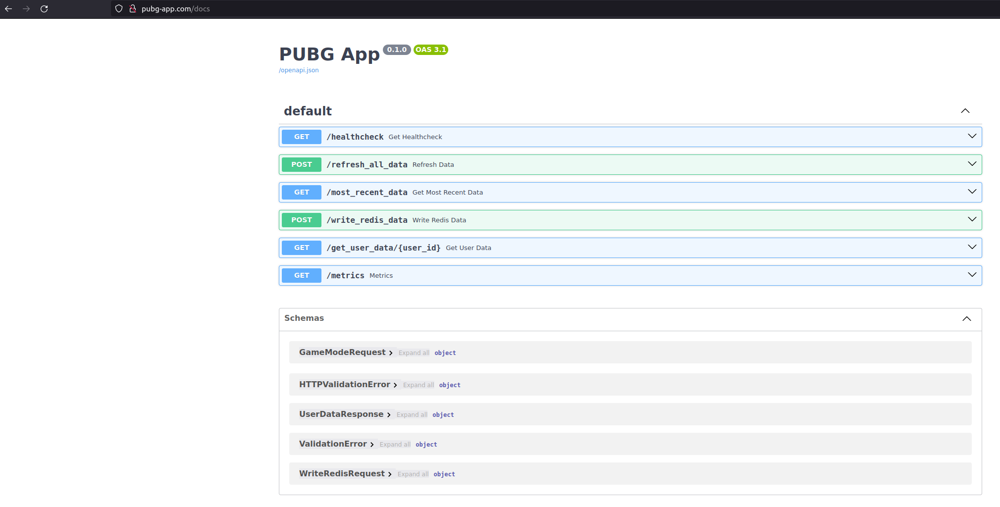
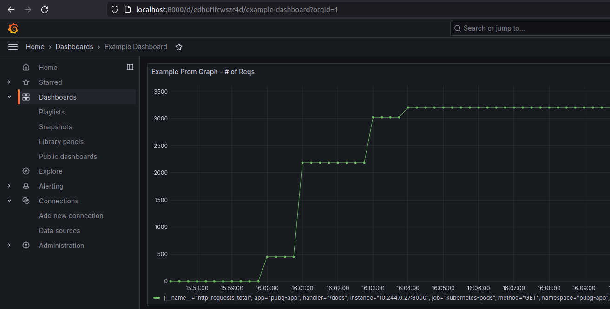
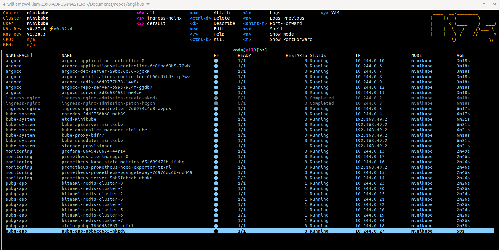
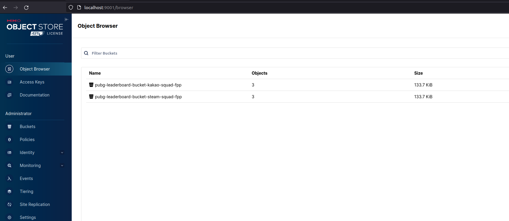

# Minikube-App

Designed to be a fully functioning, standalone app created from scratch in a minikube cluster locally.

## Features

 </a>  </a>  

     
          

## Layout

* Terraform for installing helm charts
    * Prometheus, Grafana for monitoring
    * ArgoCD for CD
    * Minio for object storage
    * Redis for low latency storage
* Python app
* Python batch jobs

## Sample Images

App UI 

Grafana Charts

Cluster Setup View

Minio Data

